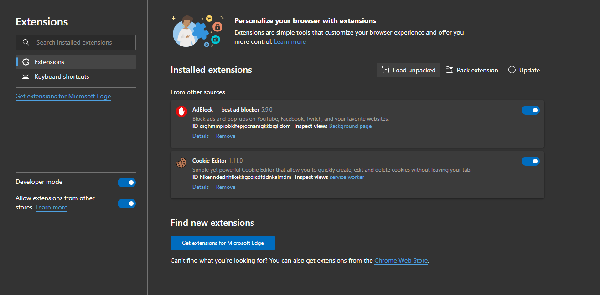

# gnostic

gnostic is a [Notion](https://www.notion.so/) plugin that allows students to create quiz-style questions from their notes with the click of a button. 

## Installation

1. Install the gnostic chrome extension.

### Chrome Web Store

Pending review. Available Soon.

### Package

Download the extension folder, then add it to your browser by going to Extensions > Load Unpacked. Note developer mode may need to be turned on.

2. Add the gnostic notion plugin.

### Testing

**To try out our integration, check out our test workspace [here](https://www.notion.so/invite/62ca4cb16817e4239716d000cf4bed81f34073ff).**

### Public

Available soon.

### Internal

In your notion workspace, add an internal integration through the [Developer Portal](https://www.notion.so/my-integrations/). The server can then be configured with the Internal Integration Secret.

3. Start writing your notes!
4. Press the gnostic button to generate a new page of questions based off your notes.
